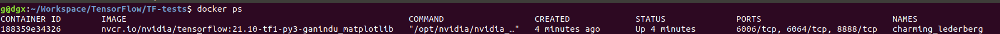

##  Docker 

Usually the first issue is running docker without admin rights 

Please refer to [this](https://github.com/pyenv/pyenv) 


If you want to attach your shell to a running container try [this](https://phase2.github.io/devtools/common-tasks/ssh-into-a-container/)

```bash
$ docker ps # use that to get the name of the running container (i.e. "cranky_dirac")
$ docker exec -it <container name> /bin/bash  # attach shell
```


## Commit changes to an image 

When we modify an image (i.e install dependencies) and want the image to retain it's modified state.

* Identify image: `$ docker ps` (hint: zoom the image below :p)


* Commit Changes `docker commit -m "your-commit-message" eager_hodgkin nvcr.io/nvidia/tensorflow:21.10-tf1-py3-ganindu_matplotlib` 


