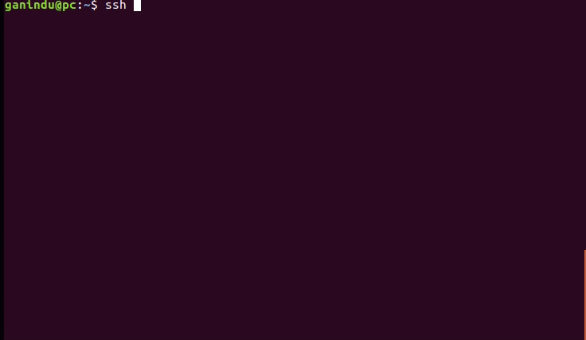

*This document is made in reference to this [README](https://github.com/D3Engineering/d3-jetson-bsp/tree/d3/4.0.0) from D3 Engineering*
### Setting up the board 

<p>To connect the FPD-Link-III SerDes board to get camera input. We need the driver to be installed on our target. Before going ahead
make sure the host is connected to the target (SSH) and the target is connected to the Internet. 
</p>

#### set up ssh key 

* create a keypair `ssh-keygen -t rsa -b 4096 -C 'ganindu@email.com'` and save the key as `~.ssh/Jetson`
* Edit the `~/.ssh/config` file

```

Host Jetson 
	# I'm using IPv6, note the double "%" before the interface name 
	Hostname fe80::b444:7974:e88:53f1%%enp0s31f6
	# Username for the Jetson board 
	User a
	IdentityFile ~/.ssh/Jetson
	StrictHostKeyChecking no
	# Not great practice but this is a dev board
	UserKnownHostsFile /dev/null

```

Then copy the newly minted ssh public key to the target <br>
`ssh-copy-id -i ~/.ssh/Jetson a@fe80::b444:7974:e88:53f1%enp0s31f6`

Then you can test this by typing `ssh Jetson` from the host, this will now drop a shell to the target.



<span style="background-color:LightYellow">
<!-- note: relative links don't seem work when pages have permalinks -->
refer to this [**network topology**](../../communication_setup#connecting-from-the-remote) section fore more about IPv6 setup, This can be done with IPv4 too. In that case you can omit the network interface name e.g. `Hostname 192.168.55.1` and the copying is simply `ssh-copy-id -i ~/.ssh/Jetson a@192.168.55.1` </span>

Also you can try the full name like this as well. 

`ssh a@fe80::b444:7974:e88:53f1%enp0s31f6` or simply `ssh a@Jetson`

#### setting up dependencies 

install the following dependencies with the command (on the target)

*make sure the target is now connected to internet as shown in the network topology above*
	
```sudo apt-get install ack build-essential cmake libexpat1-dev libgstreamer1.0-dev libgtk-3-dev libjpeg-dev libx11-dev mplayer pkg-config silversearcher-ag strace tree vlc```

#### Set up Development Environment 

This BSB uses [automake](https://www.gnu.org/software/automake/) `configure`. The `configure` script is generated by running the `bootstrap` script provided.

Move back to the **Host**

 *	Clone submodules: `git submodule update --recursive --init`.
 *	Generate the `configure` script: `./bootstrap`.
 *	Run the generated `configure` script with the correct options for your hardware. e.g. For the D3 16 port "2xOcto" camera interface, run:

 ```
 ./configure --with-system-type=xavier --with-dtb='build/deploy/boot/d3-xavier-2xocto.dtb' --with-target-host=Jetson --with-l4t=/home/ganindu/nvidia/nvidia_sdk/JetPack_4.5.1_Linux_JETSON_AGX_XAVIER/Linux_for_Tegra --with-username=a
 ```

Check the Table below for the values I've used (note: I have used a different username than `nvida`) 

 | Option | Value | Meaning |
 |--------| ------- |
 |--with-system-type | Xavier | System type |
 |--with-dtb | build/deploy/boot/d3-xavier-2xocto.dtb | goto hardware/d3/Makefile for a list of dtb file names, the files will generate at `./build/kernel/arch/arm64/boot/dts/` during build |
 |--with-target-host | Jetson | This is because of the ssh config we made earlier |
 |--with-l4t | /home/ganindu/nvidia/nvidia_sdk/JetPack_4.5.1_Linux_JETSON_AGX_XAVIER/Linux_for_Tegra| Linux for Tegra (usually installed by the SDK manager at `~/nvidia/nvidia_sdk`) |
 |--with-username | a | you may choose your username but you'll have to change some scripts down the line because at the time of writing the usename is assumed to be `nvidia` in some scripts which aren't generated |


#### install OS support 

setting up rsync 

```
ssh-copy-id @USERNAME_AT@"$TARGET"
ssh @USERNAME_SSH@ -t "$TARGET" 'sudo apt-get -y update && sudo apt-get install -y rsync'
make sync-debug
ssh @USERNAME_SSH@ -t "$TARGET" 'debug/disable-screen-lock'
```


	


