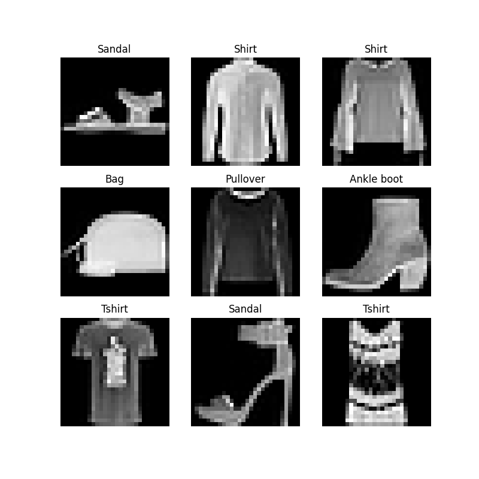
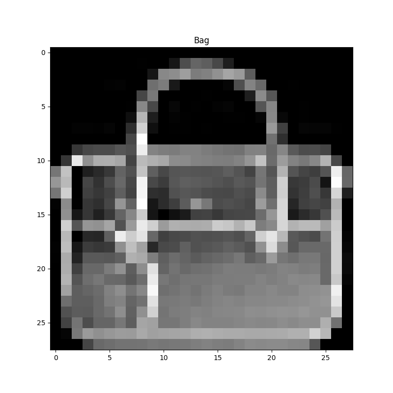

## Tensors and Data Handling with [PyTorch][PYTORCH]
<span style="background-color:LightGreen">
Created : 20/01/2022 | on Linux: 5.4.0-91-generic <br />
Updated: 27/01/2022 | on Linux: 5.4.0-91-generic <br />
Status: Draft
</span>

<span style="background-color:LightYellow"> Check the [**quickstart walkthrough**](../pytorch_walkthrough#Starting-Development-with-PyTorch)  </span>

### Datasets and Data Loaders

Separating dataset handling code *(importing, sorting, batching, separating between training, validation and testing)* and model training code *(matrix operations, error estimation: optimisation gradient navigation)* helps keep our workflows modular and reader friendly. 

The two primitives `torch.utils.Data.DataLoader` and `torch.utils.Data.Dataset` help with the Data handling side of things by aiding with pre-loaded or custom data (that we can collect and organize). 

`Dataset` stores the **[sample, label]** pairs while the `DataLoader` wraps an iterable around `Dataset` to provide functionality such as sampling and batching.


<!-- $$ \nabla_\boldsymbol{x} J(\boldsymbol{x}) $$ -->


Some [PyTorch Datasets][PYTORCH-DATASETS].

#### Loading a Dataset

```python

import torch 
from torch.utils.data import Dataset
from torchvision import datsets
from torchvision.transforms import toTensor
import matplotlib.pyplot as plt

training_data = datasets.FashionMNIST(root="data",
                                      train=True,
                                      download=True,
                                      transform=ToTensor()
                                      )

test_data = datasets.FashionMNIST(root="data",
                                  train=False,
                                  download=True,
                                  transform=ToTensor()
                                  )

```

#### Dataset Operations: Iteration and Visualisation

We can index the dataset in list form and view them in a plot in a python's "matplotlib" plot

```python

labels_map = {
    0: "T-shirt",
    1: "Trouser",
    2: "Pullover",
    3: "Dress",
    4: "Coat",
    5: "Sandal",
    6: "Shirt",
    7: "Sneaker",
    8: "Bag",
    9: "Ankle boot",
}

figure = plt.figure(figsize=(8,8))
cols, rows = 3, 3
for i in range(1, cols*rows + 1):
    sample_idx = torch.randint(len(training_data), size=(1,)).item()
    img, label = training_data[sample_idx]
    figure.add_subplot(rows, cols, i)
    plt.title(labels_map[label])
    plt.axis("off")
    plt.imshow(img.squeeze(), cmap="gray")

plt.show()
```

Here is a complete code example to achieve what's shown above 

<script src="https://gist.github.com/ganindu7/351906087bd899193c9115c2be8b9187.js?file=visualise_data.py"></script>
<br />
*The output will look like this: Note sometimes there can be incorrectly labeled items in a dataset*



#### creating a custom Dataset

A custom dataset Class must implement three functions. 

* `__init__`
* `__len__`
* `__get_item__`

The following code snippet shows how these functions are initially implemented. 

The `__init__` method takes in the annotation file, image directory and the transforms (which we will discuss in the next section) and assigns them internally to class variables. 

The `__len__` method gets the length of the labels and returns.

The `__getitem__` method reads in the image and the label entry based on the input index, The [`read_image`][TV-READ_IMAGE] function from `torchvision.io` converts the image into a tensor, applies any relevant transforms and returns an **[image , label]** pair to the caller.

<script src="https://gist.github.com/ganindu7/351906087bd899193c9115c2be8b9187.js?file=custom_datasets.py"></script>


the `labels.csv` looks like below, in the cast if the FashonMNIST dataset the enumerations are taken from the labels map


labels_map = {  <br />
    0: "T-shirt", <br />
    1: "Trouser", <br />
    2: "Pullover", <br />
    3: "Dress", <br />
    4: "Coat", <br />
    5: "Sandal", <br />
    6: "Shirt", <br />
    7: "Sneaker", <br />
    8: "Bag", <br />
    9: "Ankle-boot", <br />
} 


`labels.csv` 

```
tshirt1.jpg, 0 
tshirt2.jpg, 0 
tshirt3.jpg, 0 
...            
Coat0.jpg 4    
...            
Anke-boot234.jpg, 9 
```


### DataLoader

Dataloaders use datasets to present the data to DL pipelines. Dataloaders can randomly sample datasets to create ***minibatches.*** taking randomly sampled minibatches at subsequent epochs help minimising undesirable effects such as "overfitting".

Dataloders can be configured to use python's multiprocessing' module to [speed up operations][DATALOADERS-MP] by increasing the `num_workers`. However be cautious of side effects such as [this][DATALOADER-BUG].


```python
from torch.utils.data import DataLoader

'''
training_data: A Dataset
test_data: A Dataset 
'''
train_dataloder = DataLoader(training_data, batch_size=64, shuffle=True) # Training data loader 
test_dataloader = DataLoader(test_data, batch_size=64, shuffle=True)
``` 
Once the DataLoader is created for the corresponding dataset we are able to iterate through the dataset and return batches, the batch size and shuffle option is set 
during the DataLoader instantiation phase. After all the data is returned in one cycle another epoch is reached and based on the shuffle key the data is then shuffled. 

If you want to have finer control over the stacking order of (sample label pairs) the output batch check out [Samplers][PYTORCH-SAMPLERS].

Here is a full example!

<script src="https://gist.github.com/ganindu7/351906087bd899193c9115c2be8b9187.js?file=dataloader.py"></script>
<br />
the result will look like this.

```
Feature batch shape: torch.Size([64, 1, 28, 28])
Labels batch shape: torch.Size([64])
Label: Bag
```



### Transforms

The input data for models can sometimes differ from what comes out of the source. To bridge this gap pytorch use [transforms][TV-TRANSFORMS]. Transforms exist for both images and labels.
for example [normalizing pixels around the dataset mean][IMAGE-TF] or [one hot encoding][ONE-HOT-ENC] for labels. for this you can either use the in-built transforms or create custom transforms. 


Source: [PyTorch Tutorial][PyTorch-Tutorial]

[JETSON-URL]: https://developer.nvidia.com/embedded/jetson-agx-xavier-developer-kit
[PYTORCH]: https://pytorch.org
[NVIDIA-PYTORCH-GUIDE]: https://forums.developer.nvidia.com/t/pytorch-for-jetson-version-1-9-0-now-available/72048
[PyTorch-Tutorial]: https://pytorch.org/tutorials/beginner/basics/quickstart_tutorial.html
[FashonMnist-dataset]: https://github.com/zalandoresearch/fashion-mnist
[PYTORCH-DATASETS]: https://pytorch.org/vision/stable/datasets.html
[PYTORCH-SAMPLERS]: https://pytorch.org/docs/stable/data.html#data-loading-order-and-sampler
[TV-TRANSFORMS]: https://pytorch.org/vision/stable/transforms.html#torchvision-transforms
[TV-READ_IMAGE]: https://pytorch.org/vision/main/generated/torchvision.io.read_image.html
[DATALOADERS-MP]: https://pytorch.org/docs/stable/data.html#single-and-multi-process-data-loading
[DATALOADER-BUG]: https://github.com/pytorch/pytorch/issues/13246#issuecomment-905703662
[IMAGE-TF]: https://stats.stackexchange.com/questions/211436/why-normalize-images-by-subtracting-datasets-image-mean-instead-of-the-current
[ONE-HOT-ENC]: https://towardsdatascience.com/categorical-encoding-using-label-encoding-and-one-hot-encoder-911ef77fb5bd

<!-- Latex in markdown -->
<script src="https://cdn.mathjax.org/mathjax/latest/MathJax.js?config=TeX-AMS-MML_HTMLorMML" type="text/javascript"></script>


