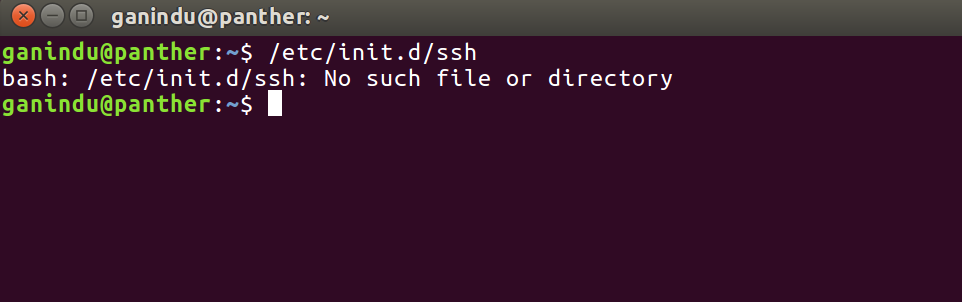
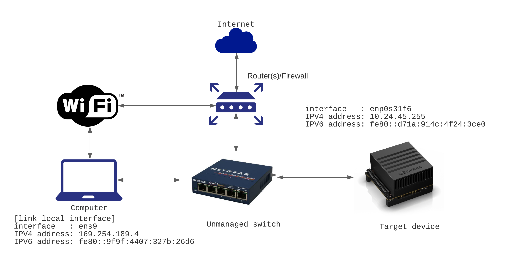
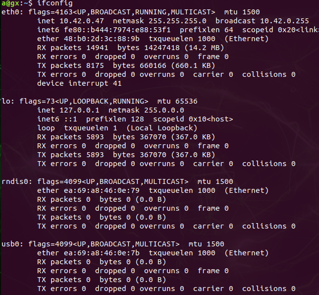
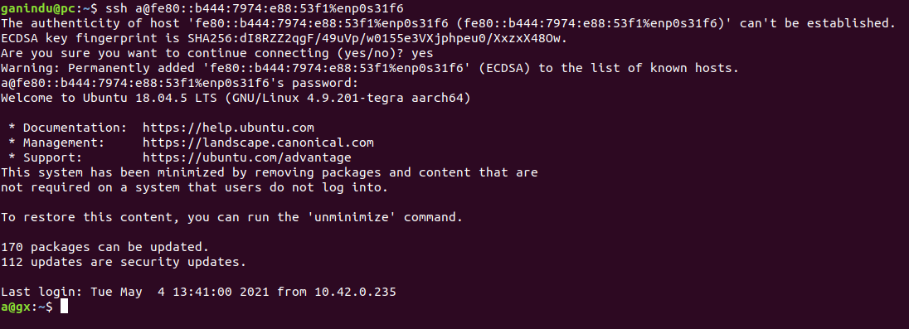

# Communicating with a target device
{: .no_toc }

For our projects we will need to communicate with target hardware in various ways. Here we wil discuss using shell and HDMI cable.
{: .fs-6 .fw-300}
<!--
## Table of contents 
{: .no_toc .text-delta}

1. TOC
{:toc}
-->
--- 
## 1. Using SSH
First we check if our target has a SSH server running, Usually you can SSH into a factory Jetson device and get started straight away. Here I've used ubuntu running on kernel `4.15.0-132-generic` ( you can check by typing  `uname -r` into the shell )

### Checking the host side 

If a server is not installed there won't be a `/etc/init.d/ssh` directory.  

If ssh server installed you can test the status by `/etc/init.d/ssh status`

Note: If you don't have SSH working on the target you won't be able to tunnel into the device, therefore use the commendline `sudo apt install openssh-server` or use a package manager like synaptic.

### Connecting from the remote  

Before connecting we need to know the IP address, username and the password for the host. Also a quick word about my setup. 

### Tutorial 

- Use the steps above to make sure ssh is working 
		  i. Find the target device ip address by typing `ifcongig` in a terminal (***use the target to execute this command***)  
		    	 

		inet6 fe80::b444:7974:e88:53f1 prefixlen 64  scopeid 0x20<link>

shows the link local ipv6 address for the interface `eth0`, we will use that to connect to this from our host computer.

- Now we ping the target from the host (***use the hosts to execute the following command***)
- From your host device ping the target  
  i. type `ping - I` ***hostinterfacename targetipv6address***    (e.g. `ping -I enp0s31f6 fe80::b444:7974:e88:53f1`)  
  The results will look like the picture below (I've pinged 4 times)

 

- Then we go to ssh'ing into our target!! 

`ssh a@fe80::b444:7974:e88:53f1%enp0s31f6`

Note the use of the interface `enp0s31f6` in the command, it's slightly different from the familiar ssh command syntax.  

 

