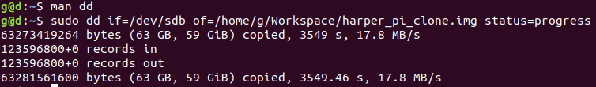
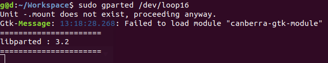
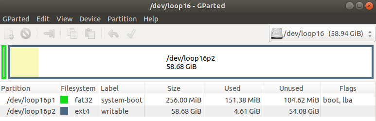
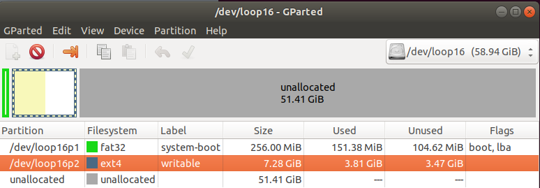
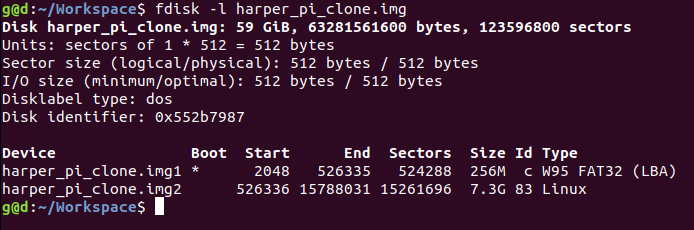

Original Sources: [1][source_1],[2][source_2],[3][source_3]

### Probelm 
I created a ubuntu server SD card for the PI, wrote some code to do stuff! Now I want to back that up efficently for resuse as a fallback or make some copies for easy replication. <br/>

I can create a 1:1 block copy using the linux [`dd`][dd_cmd_wiki] command. however it replicates the phycical card. It's not straightforward if I want to shrink it to a smaller SD card for example.

There are ways to solve this from creating a kernel patch to using a dockerfile however below is a dirty low effort way.

This solution was performed in ubuntu linux.

### Method 1 

I need to find how linux identifies my SD card.

1. Put the SD card to a reader and insert to linux 
2. Find out target device enumeration 
    2.1. use the [gnome-disks][gnome_disks] utility to find out where the disk is ![img][gnome_disks_img] <br/>

    Here you can see my SD card is at `/dev/sdb` (this is split into system-boot sdb1 and writable, sdb2 however the device is sdb) <br/>

    2.2. Alternatively you can use [lsblk][lsblk_man] to list the block devices and find out. Also note that we need to unmount the device for `dd` (in the next step) <br/>

3. Unmount the device (if mounted) 
    * use umount `/dev/sdb1` and `umount /dev/sdb2`

4. Create a copy of the whole SD card (after unmounting all the partitions mentioned in step 3)

Here I'm using the [`dd`][dd_manpages] command.(my target device is `/dev/sdb` my destination is `/home/g/Workspace/harper_pi_clone.img`)

Command:
```
sudo dd if=/dev/sdb of=/home/g/Workspace/harper_pi_clone.img status=progress
```




5. Shrinking the image 

As you may see, my SD card is quite large and I'm barely using any of the storage. To make the process efficent I need to shrink my image. (in the future I can use smaller SD cards or share my image over a low bandwidth internet connection easily).

for this step we will use [GNOME Partition Editor][gparted_web] with [fdisk][fdisk_man] to manipulate the disk partition table and [truncate][truncate_man] to resize (shrink or extend) the size of a FILE. 


Some context: [GParted][gparted_web] works on phycical devices such as hard disks, or memory cards wo we have the option to do it in the SD card itself (in my case `/dev/sdb`) prior to `dd`. but in this case I did't want to touch the original just in case. 

Now after runnning `dd` in step 4, we have an `.img` file (`harper_pi_clone.img`). To use GParted on this we now to convince GParted that this is actually a device. So now we set off to create a loopback device. 

 5.1.   
        Enable loop driver.
        ```
        sudo modprobe loop
        ```

        Set up a new loop device (associate a loop device with regular files or block devices)
        ```
        Sudo losetup -f 
        # my ouptout was `/dev/loop16`
        ```

        Create a device from the image we made earlier with `dd`
        ```
        sudo losetup /dev/loop16 harper_pi_clone.img
        ```

        Now /dev/loop16 represents harper_pi_clone.img, loop16p1 and loop16p2 represents the two partitions (system-boot and writable as I mentioned earlier) 


5.2 
        Load the new device using GParted! 
        Now let's use the loop device with GParted (install gparted with `sudo apt install gparted` if you don't have it already)

Invoking gparted 

GUI


Now you can follow through the resize the non `system-boot` partition. 




After suceesing you many notice that there some unallocated space in the drive. From the device perspective this part of the device will not be used. however we have an image pretending to be a disk. Now we need to use a different tool to shrink the image. 

to wrap up relese the loop device

```
 sudo losetup -d /dev/loop16
```

6. Trimming the unallocated space out

First we need to know where our designated partition ends and the unallocated space begins. 

```
fdisk -l harper_pi_clone.img
```


```

Disk harper_pi_clone.img: 59 GiB, 63281561600 bytes, 123596800 sectors
Units: sectors of 1 * 512 = 512 bytes
Sector size (logical/physical): 512 bytes / 512 bytes
I/O size (minimum/optimal): 512 bytes / 512 bytes
Disklabel type: dos
Disk identifier: 0x552b7987

Device               Boot  Start      End  Sectors  Size Id Type
harper_pi_clone.img1 *      2048   526335   524288  256M  c W95 FAT32 (LBA)
harper_pi_clone.img2      526336 15788031 15261696  7.3G 83 Linux

```

You can see that the second partition ends at sector `15788031`  </br>
a sector is 512 bytes (units: sectors of 512 bytes)

This means at that the unalllocated apace begins after sector 15788031 (byte (15788031+1) x 512)

Note: Sectors are zero indexed so for the count we use `(sector_id + 1) x sector_size_in_bytes`

Armed with this information now we can shrink the image! 

let's use `truncate` to shrink the image. 

```
truncate --size=$[(15788031+1)*512] harper_pi_clone.img
```


Note: We were able to use the trimmed image sucessfully to shrink a ubuntu server os from a 64Gb drive to less than 8Gb! 
However we had to use [fsck][fsck_man] to repair the filesystem on first boot (booted into safe mode in the first run). This was relatively easy! 


[source_1]: https://softwarebakery.com//shrinking-images-on-linux
[source_2]: https://askubuntu.com/a/1174509
[source_3]: http://wladimir-tm4pda.blogspot.com/2016/01/shrinking-images-on-linux.html
[dd_cmd_wiki]: https://en.wikipedia.org/wiki/Dd_(Unix)
[dd_manpages]: https://man7.org/linux/man-pages/man1/dd.1.html
[gnome_disks]: https://en.wikipedia.org/wiki/GNOME_Disks
[lsblk_man]: https://man7.org/linux/man-pages/man8/lsblk.8.html
[fdisk_man]: https://man7.org/linux/man-pages/man8/fdisk.8.html
[truncate_man]: https://man7.org/linux/man-pages/man1/truncate.1.html
[gparted_web]: https://gparted.org/index.php
[fsck_man]: https://man7.org/linux/man-pages/man8/fsck.8.html
[gnome_disks_img]: backing_up_and_restoring_bootable_linux_sd_cards/gnome-disks.png
