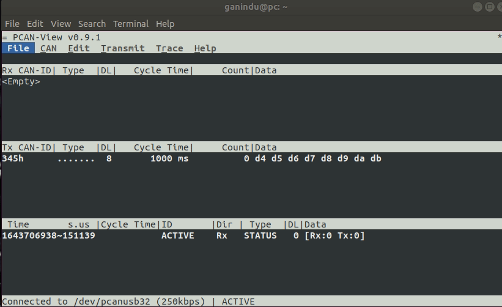
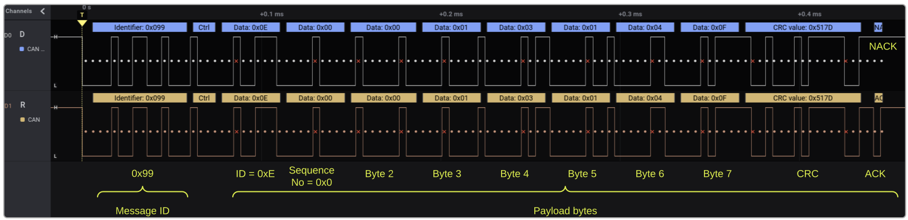
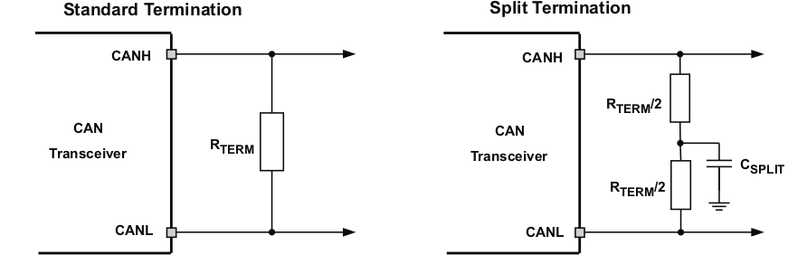
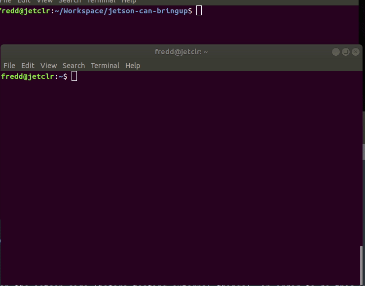

# Using CAN bus with Nvidia AGX Xavier devices
{: .no_toc }

CAN is quite useful to communicate with vehicle ECUs and telemetry systems. In this section we discuss how that can be done for Jetson-AGX Xavier devices
{: .fs-6 .fw-300}
<!--
## Table of contents 
{: .no_toc .text-delta}

1. TOC
{:toc}
-->
Note: This is a Draft <br />
<span style="background-color: lightyellow">
CAUTION: go through the the whole document at least once before attempting implementing a full system.  
</span>

---


              Figure 1. Wiring and pin connections

--- 
## 1. Basic Prerequisites

* Jetson AGX-Xavier developer platform module
* Can Transceiver IC (this can be any suitable IC, we use the [SN65HVD230][SN65HVD230] from TI).
* CAN utilities installed `$ sudo apt-get install -y can-utils busybox`

In this example I've used single core PCV thin wall cables (1mm) which is standard in most automotive settings. but you can use 0.5 mm or lower based on the connector and crimp sizes. 
To create twisted pairs you can use a vice and a drill (or hand twist of course). To verify can traffic you can use [PCAN USB PRO][PCAN-USB-PRO] or a [Vector CAN interface][VECTOR-CAN] or check [here][LINUX-CAN-STUFF] for some recommendations from the [embedded Linux community][ELINUX-ORG]. In the Example I've used a [PCAN View][PCAN-VIEW] with a PCAN USB device in a Linux machine( there is a graphical windows interface for MS Windows). 

## Connecting and Configuring the Nvidia Jetson AGX-Xavier 

### Kernel DTB

first you need to check if the CAN nodes are enabled in the kernel device tree binary that is flashed in to the device. 

```shell
$ cat /proc/device-tree/mttcan\@c310000/status
``` 

### Pinmux

A CAN configured Pinmux can be set in different ways.

* Update the pinmux config files pre-flashing.
* Use the graphical [Jetson-IO tool][JETSON-IO-TOOL]
* Use a [busybox devmem tool][BUSYBOX-DEVMEM] to write to hardware registers. (Changes will persist until next system boot) <br />
 Install busybox `$ sudo apt install busybox`
 `busybox devmem <register> w <value>` ( you can pick the register values from Table 1 below )
e.g. 
```shell
$ sudo busybox devmem 0x0c303010 w 0x400
$ sudo busybox devmem 0x0c303018 w 0x458
```


 | CAN peripheral          | Controller base address | pins on board | port addr |register    | value | chip conn (SN65HVD230) |
 |-------------------------|-------------------------| ------------- |-----------|------------| ------| -----------------------|
 |  <center>CAN0</center>  | mttcan@c310000          | 29            | can0_din  | 0x0c303018 | 0x458 | R (RX)                 |
 |  <center>"</center>     | <center>"</center>      | 31            | can0_dout | 0x0c303010 | 0x400 | D (TX)                 |
 |  <center>CAN1</center>  | mttcan@c320000          | 37            | can1_din  | 0x0c303008 | 0x458 | R (RX)                 |
 |  <center>"</center>     | <center>"</center>      | 33            | can1_dout | 0x0c303000 | 0x400 | D (TX)                 |

<center> Table 1. Configuring the CAN peripheral on NVIDIA Jetson AGX-Xavier  </center>


### Loading Kernel Drivers
load all the necessary kernel drivers in the following order.
1. `$ modprobe can`
2. `$ modprobe can_raw`
3. `$ modprobe mttcan`

### Network interface setup 

Example to set up a 250Kbps network. with presumed acknowledgement. *(suited to a test network with one or two nodes to prevent BUSHEAVY conditions)*

```shell
$ sudo ip link set can0 type can bitrate 250000 presume-ack on restart-ms 2000
$ sudo ip link set can0 up
```

You can use the shell script below to set all the steps in one go. <br />
<span style="background-color: lightyellow">
you can run `$ chmod +x scriptname.sh` (maybe with sudo) and then `./scriptname.sh`
</span>


<script src="https://gist.github.com/ganindu7/fb8fa77394ecd22516567bf8cf2fe957.js?file=run.sh"></script>


## Testing and running code


<script src="https://gist.github.com/ganindu7/fb8fa77394ecd22516567bf8cf2fe957.js?file=test.py"></script>

bus trace 


<center> Figure 2. PCAN View CAN trace </center>

trace


<center> Figure 2. Can Signal Trace (open in new tab for better resolution) </center>
<span style="background-color: lightyellow">
Note: If you don't provide a node on the bus that does not acknowledge or do not put anything other than the sending node and the tracer the acknowledge will not be present as shown above. 
adding instruction lines like e.g. `sudo ip link set can0 type can bitrate 250000 presume-ack on restart-ms 2000` will tell the interface to cope with out and ACK and even reset the bus in case of 
a "crazy chatty" node.
</span>

## Connecting to the CAN bus 


            Figure 3. CAN bus, source: [datasheet][SN65HVD230]


## Circuit design ideas 



            Figure 3. PCB Can termination, source: [datasheet][SN65HVD230]

## PCB design ideas 

Because ESD and EFT transients can be between 2Mhz and 3GHz approximately High frequency layout guidelines must be applied to the PCB design. 
To work in machines or vehicle plants external transient protection devices must be used at bus connectors to prevent these transients from propagating into the PCB.

* Use power and ground planes to provide low inductance paths for high frequency signals to dissipate into (rather than onto signal paths) and provide shielding. 
* Design bus protection components in the direction of the signal path. (do not force transients to divert from the signal path to reach the protection device e.g. capacitor) 
* It is advised to use transient voltage suppression devices (TVS) bi directional diodes or varistors and bus filter capacitors, bus transient devices should be placed close to the connector to stop them from coming in. 
* You may use CAN termination on the board but however if it is used the device should be an end node and should not be removed without adding a substitute termination to the bus. (split termination provides common mode filtering from the bus)
* bypass and bulk capacitors must be placed as close to the supply pins of the transceiver. 
* use at least two vias for vcc and ground connections of bypass capacitors and protection devices to minimise trace and via inductance. 
* to limit current via digital lines serial resistors may be used. 
* to filter noise on the digital IO lines a capacitor may be used to close the input side the IO as shown by C1 and C4.
* since the internal pull up and pull down biasing of the device is weak in the face of transients for floating pins an external 1k to 10 k pull up/down should be used to bias the state of the pin nore strongly against the noise during transient events. 
* If D(TxD) is driven via an open drain/collector it should be pulled up to vcc when it is not shorted to GND through the driving gate. (look at R1)
* if the device is only operating on normal mode or slope control R£ is not needed and C4 pads can be used for the pulldown resistor to ground. 
if pin5 is not used it can be left floating. 


<center> Figure 4. PCB footprint suggestion, source: [datasheet][SN65HVD230] </center>


## Troubleshooting CAN

Setting up the physical can bus and get the electrical and software components working altogether can be challenging at times. This section is to address some of these problems in a Q&A
style writeup.

### the setup stage works fine but can't see any messages on the bus. 

This could be either an internal or external issue. first of all we need to eliminate the possibility of a failure on the jetson side (before testing external things). in order to do this we can do a loopback test  

<script src="https://gist.github.com/ganindu7/fb8fa77394ecd22516567bf8cf2fe957.js?file=loopback_can.sh"></script>

at this point you can invoke the previously mentioned [python script](#testing-and-running-code) or a `cansend` command alongside [candump][CANDUMP] (e.g. run `candump can0` in a different shell)

If the jetson internals are working fine you should get something similar to what is shown below (we've run the [script](#testing-and-running-code) in the *testing and running section* )



if you get the output above and still got problems it seems that the software is running fine. However we still can't rule out clock issues that may not help with sampling issues.

[SN65HVD230]: https://www.ti.com/lit/ds/symlink/sn65hvd230.pdf
[PCAN-USB-PRO]: https://www.peak-system.com/PCAN-USB-Pro-FD.366.0.html?&L=1
[VECTOR-CAN]: https://www.vector.com/int/en/products/products-a-z/hardware/network-interfaces/vn7640
[LINUX-CAN-STUFF]: https://elinux.org/CAN_Bus
[ELINUX-ORG]: https://elinux.org/
[PCAN-VIEW]: https://www.peak-system.com/PCAN-View.242.0.html?&L=1
[JETSON-IO-TOOL]: https://docs.nvidia.com/jetson/l4t/Tegra%20Linux%20Driver%20Package%20Development%20Guide/hw_setup_jetson_io.html#wwpID0E0ZE0HA
[BUSYBOX-DEVMEM]: https://www.busybox.net/downloads/BusyBox.html
[CANDUMP]: http://manpages.ubuntu.com/manpages/bionic/man1/candump.1.html