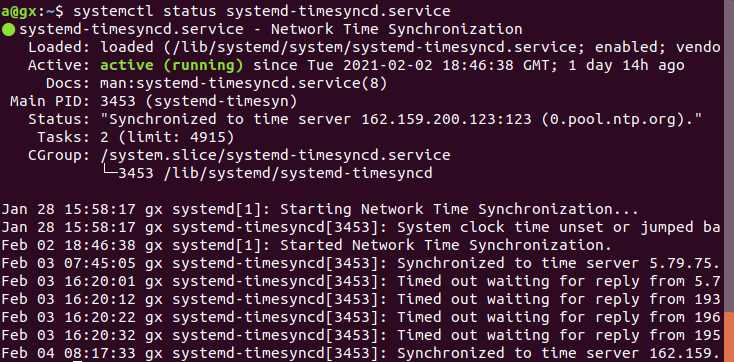

## Get RTCs to sync

Here we attempt to use the ubuntu [NTP](https://en.wikipedia.org/wiki/Network_Time_Protocol) servers to sync up a target and a host. You can set up your own servers of connect to others too. 

Extra Tip: Sometimes the Jetson can have issues with the RTC i.e. bad supercap so It's a good idea to leave it for some time after time is set up initially and later check for drift. 

Open a terminal windo and type `$ systemctl status systemd-timesyncd.service` you should see the address of the NTP server and the revlent statistics. Some firewalls do not allow NTP sync from these servers then you'll have to manually provide non-blacklisted server details or create an alternate route.

