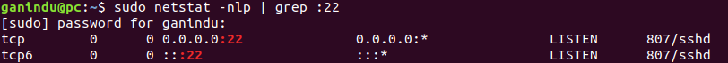
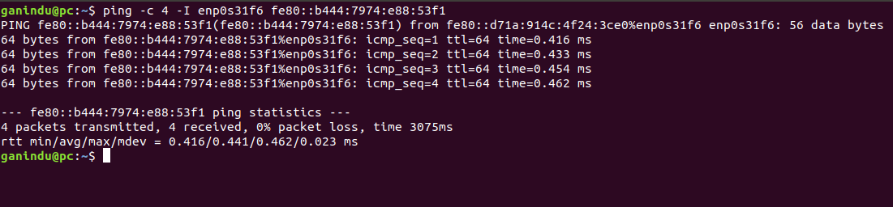

# Communicating with a target device
{: .no_toc }

For our projects we will need to communicate with target hardware in various ways. Here we wil discuss using shell and HDMI cable.
{: .fs-6 .fw-300}
<!--
## Table of contents 
{: .no_toc .text-delta}

1. TOC
{:toc}
-->
--- 
## 1. Using SSH
First we check if our target has a SSH server running, Usually you can SSH into a factory Jetson device and get started straight away. Here I've used ubuntu running on kernel `4.15.0-132-generic` ( you can check by typing  `uname -r` into the shell )

### Checking the host side 

If a server is not installed there won't be a `/etc/init.d/ssh` directory.  


If ssh server installed you can test the status by `/etc/init.d/ssh status`


Note: If you don't have SSH working on the target you won't be able to tunnel into the device, therefore use the commendline `sudo apt install openssh-server` or use a package manager like synaptic.
Firewall check:
make sure you are listening on port 22 <br/>
`sudo netstat -nlp | grep :22`

then check for the fireall if necessary with with `sudo ufw status` <br/>
If SSH is not allowed to use port 22 <br/>
`sudo ufw allow 22` <br>
for more info check [here](https://unix.stackexchange.com/questions/105800/not-able-to-ssh-to-another-computer-but-can-ping-it).

### Connecting from the remote  

Before connecting we need to know the IP address, username and the password for the host. Here is a diagram of a setup. 


### SSHFS Mounting
Mounting files across devices is very handy when you don't want to plug phycical storage memory into a device but you want to use the processing capabilities of the device (when the task may require more storage memory or you may just want the data to live in a seprate device) 
<span style="background-color: lightYellow">
 <br/> *For example you can mount traning data via a ssh mount to not consume space on a HPC or you can run testing on an edge device with offline file data where input/output files are stored in your develoment computer.*   
</span>
***Note: At the time of writing this sshfs mounting seem to only work on IPV4*** <br/><br/>
HOWTO:
1. `ssh` into the remote computer (I've run this in a Nvdia Jetson and Nvidia DGX devices) 
2. `cd` into the directory you want the mount pooint to be
3. Create a directoy *e.g. `$PWD/folder/in/local/computer`* (Reminder: In this context the `../local/computer` is the device you `ssh`'d  into)
4. (optional?) edit `/etc/fuse.conf` (with superuser) of the device you are in to allow non-root users to specify the allow_other or allow_root mount options.
5. Type `sshfs -o allow_other usernameu@IPv4_adderess:/folder/in/remote/computer $PWD/folder/in/local/computer`


<!--  -->

In the picture above the `$HOME/Videos` directory from the remote computer is mounted into the `$PWD/data` directory. 


### Tutorial (for SSH)

- Use the steps above to make sure ssh is working.

	<ul>
		<li>
		Find the target device ip address by typing `ifcongig` in a terminal (<strong>use the target to execute this command</strong>) 
		</li>
	</ul>

	
	</br>
	Now observe this line below.
	```
	inet6 fe80::b444:7974:e88:53f1 prefixlen 64  scopeid 0x20<link>
	```

this shows the link local ipv6 address for the interface `eth0`, we will use that to connect to this from our host computer.

- Now we ping the target from the host (***use the host device (Computer) to execute the following command***)
- From your host device ping the target <br>
  i. type `ping - I host_interface_name target_ipv6address` <br>  (e.g. `ping -I enp0s31f6 fe80::b444:7974:e88:53f1`) <br>
  The results will look like the picture below (I've pinged 4 times)

 

- Then we go to ssh'ing into our target!! 

`ssh a@fe80::b444:7974:e88:53f1%enp0s31f6`


<span style="background-color:LightYellow">
Note the use of the interface `enp0s31f6` in the command, it's slightly different from the familiar ssh command syntax. each computer and network interface is differnt so you will need to find the 
network interface name that is right </span>


 


#### set up ssh key and update ssh config file for easy access.  

**[Do this on the Host]** 

* create a keypair `ssh-keygen -t rsa -b 4096 -C 'ganindu@email.com'` and save the key as `~.ssh/Jetson` (Note: Remember the check out the latest key algorithm, size etc [more info](https://stackoverflow.com/questions/51834225/why-use-t-rsa-b-4096-with-ssh-keygen)) 
* Edit the `~/.ssh/config` file

```
Host Jetson 
	# I'm using IPv6, note the double "%" before the interface name 
	Hostname fe80::b444:7974:e88:53f1%%enp0s31f6
	# Username for the Jetson board 
	User a
	IdentityFile ~/.ssh/Jetson
```


Then copy the newly minted ssh public key to the target <br>
`ssh-copy-id -i ~/.ssh/Jetson a@fe80::b444:7974:e88:53f1%enp0s31f6`

<span style="background-color:LightYellow">
Note: Make sure you have got the username of the target correct! for example if the username is `username` the command becomes
<br>
`ssh-copy-id -i ~/.ssh/Jetson username@fe80::b444:7974:e88:53f1%enp0s31f6` <br/> or (you can append '.pub' to the end of the keyfile if it is generated that way) <br/> `ssh-copy-id -i ~/.ssh/Jetson.pub username@fe80::b444:7974:e88:53f1%enp0s31f6`
</span>

Then you can test this by typing `ssh Jetson` from the host, this will now drop a shell to the target.

**more information on setting up a VNC (also is on the L4T readme file) can be found [here](https://gist.github.com/dusty-nv/0329cd330edb608673a7c016be901be8).**

## Host superuser access 

Although this is not advised, you can set up superuser privileges by copying the `sudoers` file below to `/etc/sudoers` and setting permission to `440`

```
cp sudoers /etc/sudoers
chmod 440 /etc/sudoers
```

here is a script that uses the `sudoers` file linked below to set permissions.  

{: .mx-1}
<script src="https://gist.github.com/ganindu7/f873280f19cc7bc95e1886e0e65b85a4.js?file=run.sh"></script>
{: .mx-1}

The `sudoers` file 


{: .mx-1}
<script src="https://gist.github.com/ganindu7/f873280f19cc7bc95e1886e0e65b85a4.js?file=sudoers"></script>
{: .mx-1}


## SSH XSession forwarding with SuperUser
1. Connect to the remote computer with ssh -X (As shown above in step 1)
e.g.  `ssh -X me@my_remote_computer` or use `~/.ssh/Config` file as discussed above and type `ssh  my_remote_computer` <br/>

2. Get Magic Cookie for current display

```
xauth list $DISPLAY

my_remote_computer/unix:10  MIT-MAGIC-COOKIE-1  9cdf2a6d1c9bdaff34ghvd78ghj21357

```
3. GET local `DISPLAY` variable (this is just confirm)

```
echo $DISPLAY

```

4. log in as sudo (this will drop a superuser shell at the root)

```
sudo su 

``` 

5. Generate new .Xauthority file at `/`

```
xauth add my_remote_computer/unix:10  MIT-MAGIC-COOKIE-1  9cdf2a6d1c9bdaff34ghvd78ghj21357

```

Note: the default location is `/root` , you can use `/` without any problem (I've tested in ubuntu server)

## X Session within Docker 

In addition to the options listed above you can mount the unix domain socket (`/tmp/.X11-unix/X${DISPLAYNUMBER`}) and the `.Xauthority` file in the respective $HOME directory.

```
	volumes:
	    # unix domain socket
	    - /tmp/.X11-unix:/tmp/.X11-unix:rw
	    # For user (optional)
	    - $HOME/.Xauthority:/home/nvidia/.Xauthority:rw
	    # For root (optional)
	    - $HOME/.Xauthority:/root/.Xauthority:rw
```


# A note for Microsoft Windows users 
Date updated: 15/01/2022 | Tested on windows 10 


```
ssh command: ssh -6 user@<IPV6 address>

e.g. ping -6 username@fe80::b444:7974:e88:53f1

``` 

ssh into the remote and add the public key to the end of the "authorized_keys" file (in a new line)

Below here is an example entry for a ssh config file.

Within WSL
```
Host DGX-ganindu
  HostName fe80::4bac:e943:26d1:bf03
  User	ganindu
	ForwardAgent yes
	IdentityFile ~/.ssh/DESKTOP-WSL-SSHKEY
	StrictHostKeyChecking no
  UserKnownHostsFile /dev/null
  ForwardX11 yes
```
Within Windows
```
Host DGX-ganindu
  HostName fe80::4bac:e943:26d1:bf03
  User	ganindu
	ForwardAgent yes
	IdentityFile C:\Users\Ganindu\.ssh\WINDOWS-DESKTOP
	StrictHostKeyChecking no
  UserKnownHostsFile /dev/null
  ForwardX11 yes
```

Note the difference is the absolute path for the keys. you can use powershell to add the keys to the client. I experienced a file permissions too open error when I tried to use an existing key 
but it went away when I created a key within the respective system (bash in WSL or powershell in windows)

If you want to have X forwarding install a X server (i.e. [XLaunch](https://x.cygwin.com/docs/xlaunch/display.html)) to forward magic cookies to hosts. 
check out [xming](https://sourceforge.net/projects/xming/)

Warning : These are representative for what worked for me but depending on your setup things may vary. 


