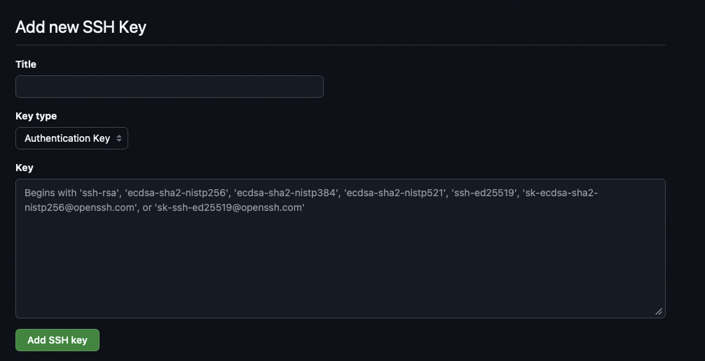

## Using Git inside Docker

Status: Draft | Updated: {{ page.path | file_date | date_to_string }}

## Motivation

Let a user clone, pull and push GitHub repositories from inside a container on a shared machine without leaving any credential on that machine, only while he has an SSH session open, and without having to restart the container every time that session drops and he logs back in.

### Brief

On login, ssh forwards the laptop's agent to a **fixed path** on the remote e.g. `~/.ssh-agent/sock`. A process can then *sign* with his key but cannot read it. In our case the container bind-mounts the `~/.ssh-agent` directory. When user logs out the socket goes dead and the container loses access; when he logs back in, the socket is recreated at the same path and the same container works again.

Plain `ForwardAgent yes` is not enough for this: sshd puts the forwarded socket under a random `/tmp/ssh-XXXX/` path on every login, so a running container (or an old tmux shell) keeps pointing at the previous, dead socket.

### 1. On the laptop: create a key and add it to GitHub

```shell
ssh-keygen -t ed25519 -f ~/.ssh/id_ed25519_wills_laptop_key -C "will@example.com"
ssh-add ~/.ssh/id_ed25519_wills_laptop_key   # macOS: ssh-add --apple-use-keychain ~/.ssh/id_ed25519_wills_laptop_key
```

Optionally: Give the key a passphrase. The agent remembers it, so you type it once per laptop session, and a copied key file is useless without it.

If you have a FIDO2 hardware key, `ssh-keygen -t ed25519-sk` makes a key that also needs a touch for every use, which is the strongest option here.

Then copy the *public* half (`cat ~/.ssh/id_ed25519_wills_laptop_key.pub`) into the GitHub UI under Settings, SSH and GPG keys:



### 2. On the remote machine, do this once to set a fixed socket mount path

```shell
mkdir -m 700 ~/.ssh-agent
echo 'export SSH_AUTH_SOCK=$HOME/.ssh-agent/sock' >> ~/.bashrc
```

As the admin, in `/etc/ssh/sshd_config`, then `sudo systemctl reload ssh`:

```
StreamLocalBindUnlink yes
```

Without this, the socket file left behind by the previous session blocks the next login from binding to the same path (you would see `remote port forwarding failed for listen path`).

### 3. On the laptop: forward the agent to that path, only for the target remote machine you are working on

```
# ~/.ssh/config
Host dgx
    HostName <dgx address>
    User will
    RemoteForward /home/will/.ssh-agent/sock ${SSH_AUTH_SOCK}
```

The remote path must be absolute (`echo $HOME` on the dgx if unsure). The one-off equivalent is `ssh -R /home/will/.ssh-agent/sock:$SSH_AUTH_SOCK dgx`. Now check from the dgx shell, including inside an old tmux session:

```shell
ssh-add -l              # lists the laptop key
ssh -T git@github.com   # "Hi will! You've successfully authenticated..."
```

No key files were created on the dgx. Only forward the agent to hosts you trust: while you are connected, root on that host can *use* the socket (it cannot extract the key). `ssh-add -c` on the laptop makes the agent ask for confirmation on every use if you want that extra check.

Set the identity git should use for commits (this is not a secret):

```shell
git config --global user.name "Will Example"
git config --global user.email "will@example.com"
```

### 4. The compose override: hand the socket directory to the container

Next to the project's compose file add an override, e.g. `/home/will/wills-sandbox/docker-compose.override.yaml` (name it `compose.override.yaml` if the base file is `compose.yaml`). Compose loads it automatically, no `-f` needed, so the shared compose file stays untouched and everyone can keep their own override.

```yaml
services:
  wills-sandbox:   # the service name from the base compose file
    volumes:
      - ${HOME}/.ssh-agent:/run/ssh-agent
      - ${HOME}/.gitconfig:/etc/gitconfig:ro
    environment:
      SSH_AUTH_SOCK: /run/ssh-agent/sock
```

Mount the *directory*, not the socket file. A bind mount of a file is pinned to the inode that existed when the container started, so the fresh socket a new login creates would be invisible. A directory mount shows whatever is in it now.

The container can be long-lived:

```shell
docker compose up -d
docker compose exec wills-sandbox bash
```

Inside the container:

```shell
ssh-add -l   # same key as on the dgx, still no key file anywhere
ssh -T git@github.com

```


Now check if git works across sessions with github
